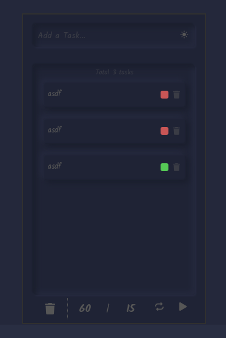
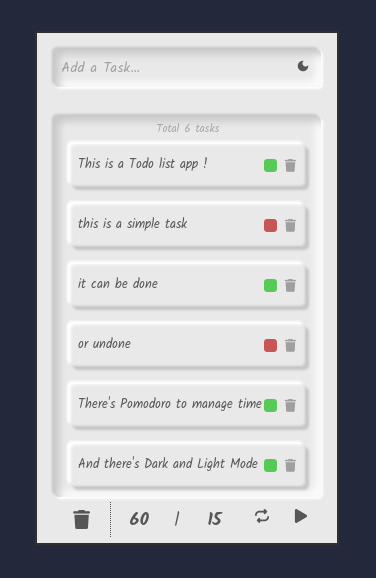

# Todos (Tauri + React + Typescript)

A Todo list app with pomodoro to manage tasks and time! 

## Features

1. **Add and Delete Tasks**

2. **Mark Tasks as complete or uncomplete**

3. **Have fun switching between dark and light mode**

4. **User the Pomodoro to manage your work or study time!**

### Installation

Clone the project

cd Todo

npm install

npm tauri run build
